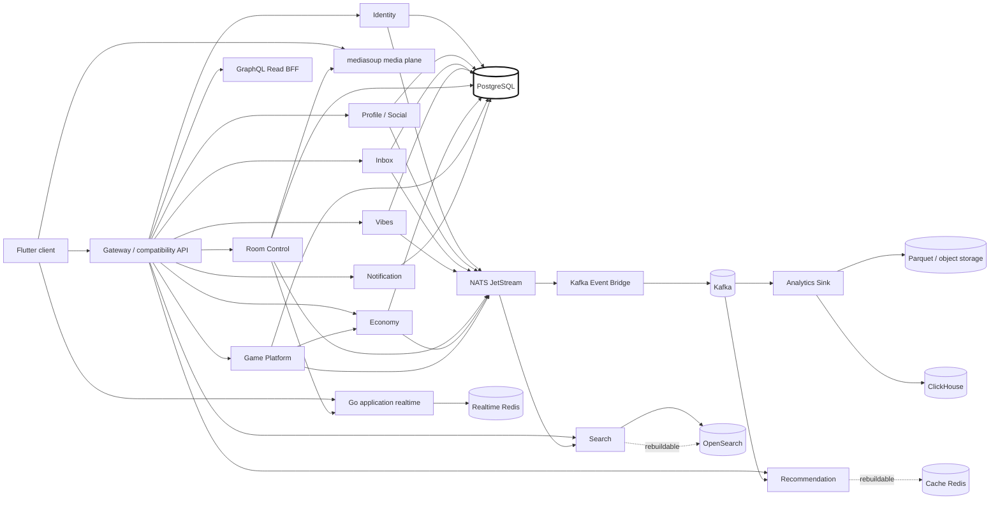

# FunKey system map

This diagram is documentation of the same authority model enforced in code and
contracts. It must evolve with deployable/service-boundary changes.

## Conformance invariants

- PostgreSQL/domain owners remain durable business truth.
- Economy is the only financial mutation authority.
- Redis, OpenSearch, Recommendation state, ClickHouse and the data lake are
  reconstructable/cache/analytical state, not command authority.
- NATS is operational async transport; Kafka is retained analytics/replay/ML,
  not synchronous RPC.
- Flutter has one application WebSocket and one canonical REST networking path.
- mediasoup owns media transport only.
